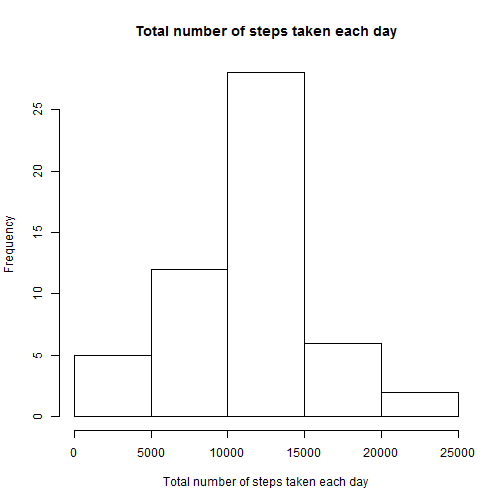
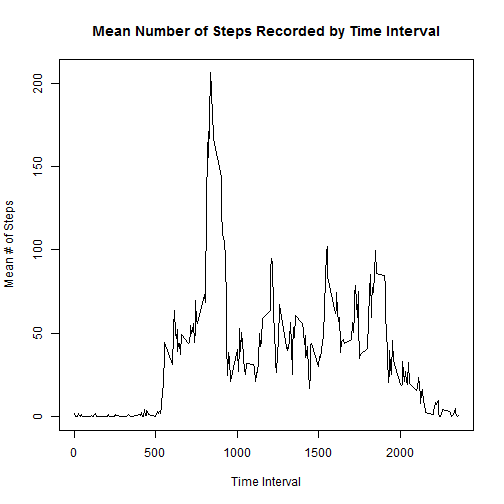
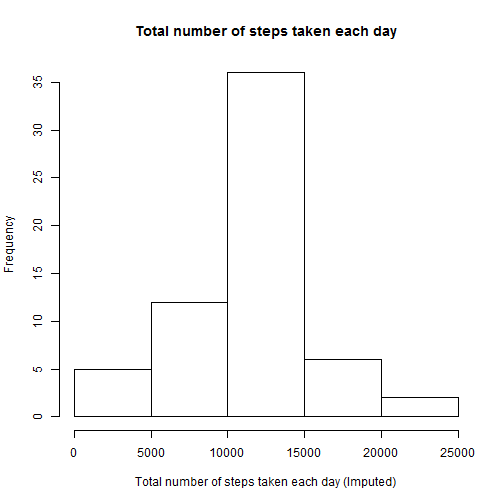
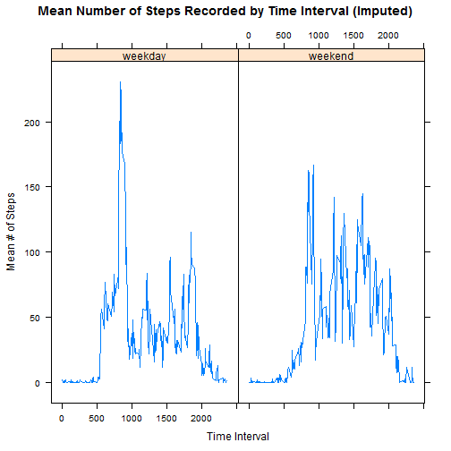

## Loading and preprocessing the data
Load libraries and data

```r
library(lattice)
activity <- read.csv("activity.csv")
```
Look at structure of loaded data

```r
str(activity)
```

```
## 'data.frame':	17568 obs. of  3 variables:
##  $ steps   : int  NA NA NA NA NA NA NA NA NA NA ...
##  $ date    : Factor w/ 61 levels "2012-10-01","2012-10-02",..: 1 1 1 1 1 1 1 1 1 1 ...
##  $ interval: int  0 5 10 15 20 25 30 35 40 45 ...
```

```r
head(activity)
```

```
##   steps       date interval
## 1    NA 2012-10-01        0
## 2    NA 2012-10-01        5
## 3    NA 2012-10-01       10
## 4    NA 2012-10-01       15
## 5    NA 2012-10-01       20
## 6    NA 2012-10-01       25
```
Preprocess data as required for next steps (create subset with NA values removed)

```r
act.no.na <- activity[!is.na(activity), ]
```

## What is mean total number of steps taken per day?
Generate a histogram of the total number of steps taken each day.

```r
act.date.sum <- aggregate(act.no.na$steps, by = list(date = act.no.na$date), 
    FUN = sum)
hist(act.date.sum$x, xlab = "Total number of steps taken each day", main = "Total number of steps taken each day")
```


Generate Mean and Median number of steps taken each day.

```r
act.date.mean <- aggregate(act.no.na$steps, by = list(date = act.no.na$date), 
    FUN = mean)
act.date.med <- aggregate(act.no.na$steps, by = list(date = act.no.na$date), 
    FUN = median)
act.date.summary <- cbind(act.date.sum, act.date.mean$x, act.date.med$x)
names(act.date.summary) <- c("date", "sum", "mean", "median")
rm(act.date.sum, act.date.mean, act.date.med)
act.date.summary
```

```
##          date   sum       mean median
## 1  2012-10-02   126  0.4375000      0
## 2  2012-10-03 11352 39.4166667      0
## 3  2012-10-04 12116 42.0694444      0
## 4  2012-10-05 13294 46.1597222      0
## 5  2012-10-06 15420 53.5416667      0
## 6  2012-10-07 11015 38.2465278      0
## 7  2012-10-09 12811 44.4826389      0
## 8  2012-10-10  9900 34.3750000      0
## 9  2012-10-11 10304 35.7777778      0
## 10 2012-10-12 17382 60.3541667      0
## 11 2012-10-13 12426 43.1458333      0
## 12 2012-10-14 15098 52.4236111      0
## 13 2012-10-15 10139 35.2048611      0
## 14 2012-10-16 15084 52.3750000      0
## 15 2012-10-17 13452 46.7083333      0
## 16 2012-10-18 10056 34.9166667      0
## 17 2012-10-19 11829 41.0729167      0
## 18 2012-10-20 10395 36.0937500      0
## 19 2012-10-21  8821 30.6284722      0
## 20 2012-10-22 13460 46.7361111      0
## 21 2012-10-23  8918 30.9652778      0
## 22 2012-10-24  8355 29.0104167      0
## 23 2012-10-25  2492  8.6527778      0
## 24 2012-10-26  6778 23.5347222      0
## 25 2012-10-27 10119 35.1354167      0
## 26 2012-10-28 11458 39.7847222      0
## 27 2012-10-29  5018 17.4236111      0
## 28 2012-10-30  9819 34.0937500      0
## 29 2012-10-31 15414 53.5208333      0
## 30 2012-11-02 10600 36.8055556      0
## 31 2012-11-03 10571 36.7048611      0
## 32 2012-11-05 10439 36.2465278      0
## 33 2012-11-06  8334 28.9375000      0
## 34 2012-11-07 12883 44.7326389      0
## 35 2012-11-08  3219 11.1770833      0
## 36 2012-11-11 12608 43.7777778      0
## 37 2012-11-12 10765 37.3784722      0
## 38 2012-11-13  7336 25.4722222      0
## 39 2012-11-15    41  0.1423611      0
## 40 2012-11-16  5441 18.8923611      0
## 41 2012-11-17 14339 49.7881944      0
## 42 2012-11-18 15110 52.4652778      0
## 43 2012-11-19  8841 30.6979167      0
## 44 2012-11-20  4472 15.5277778      0
## 45 2012-11-21 12787 44.3993056      0
## 46 2012-11-22 20427 70.9270833      0
## 47 2012-11-23 21194 73.5902778      0
## 48 2012-11-24 14478 50.2708333      0
## 49 2012-11-25 11834 41.0902778      0
## 50 2012-11-26 11162 38.7569444      0
## 51 2012-11-27 13646 47.3819444      0
## 52 2012-11-28 10183 35.3576389      0
## 53 2012-11-29  7047 24.4687500      0
```

## What is the average daily activity pattern?
Make a time series plot of the 5-min interval (x-axis) and the average number of steps taken, averaged across all the days (y-axis).

```r
act.int.mean <- aggregate(act.no.na$steps, by = list(interval = act.no.na$interval), 
    FUN = mean)
names(act.int.mean) <- c("interval", "mean")
plot(act.int.mean$interval, act.int.mean$mean, type = "l", xlab = "Time Interval", 
    ylab = "Mean # of Steps", main = "Mean Number of Steps Recorded by Time Interval")
```


Which 5-minute interval, on average across all the days in the data set, contains the maximum number of steps?

```r
act.int.mean[which.max(act.int.mean[, 2]), ]
```

```
##     interval     mean
## 104      835 206.1698
```
Answer: 835

## Imputing missing values
Calculate and report the total number of missing values in the data set.

```r
sum(is.na(activity))
```

```
## [1] 2304
```
Answer: 2304  
Devise a strategy to impute the missing values of the data set.  
Decision: Fill in missing values with the mean across all days for that particular 5-minute interval.  

Create a new dataset that is equal to the original, but with missing data imputed.

```r
act.impute <- activity
for (i in 1:nrow(act.impute)) {
    if (is.na(act.impute[i, 1])) {
        int.mean <- act.int.mean[act.int.mean$interval == act.impute$interval[i], 
            2]
        act.impute$steps[i] <- int.mean
    }
}
```
Make a histogram of the total number of steps taken each day

```r
act.date.sum2 <- aggregate(act.impute$steps, by = list(date = act.impute$date), 
    FUN = sum)
hist(act.date.sum2$x, xlab = "Total number of steps taken each day (Imputed)", 
    main = "Total number of steps taken each day")
```


Calculate and report the mean and median total number of steps taken per day.

```r
act.date.mean2 <- aggregate(act.impute$steps, by = list(date = act.impute$date), 
    FUN = mean)
act.date.med2 <- aggregate(act.impute$steps, by = list(date = act.impute$date), 
    FUN = median)
act.date.summary2 <- cbind(act.date.sum2, act.date.mean2$x, act.date.med2$x)
names(act.date.summary2) <- c("date", "sum", "mean", "median")
rm(act.date.sum2, act.date.mean2, act.date.med2)
```
Do these values differ from the first part of the assignment? What is the impact of imputing missing data on the estimates of the total daily number of steps?

```r
summary(act.date.summary$sum)
```

```
##    Min. 1st Qu.  Median    Mean 3rd Qu.    Max. 
##      41    8841   10760   10770   13290   21190
```

```r
summary(act.date.summary2$sum)
```

```
##    Min. 1st Qu.  Median    Mean 3rd Qu.    Max. 
##      41    9819   10770   10770   12810   21190
```
Answer: The means, medians, mins and max values are not strikingly different between the two populations, but the 1st and 3rd quartiles indicate a left shift in skew. (1st quartile was higher, 3rd quartile was lower)

## Are there differences in activity patterns between weekdays and weekends?
Create a new factor variable in the dataset with two levels: "weekday" and "weekend" indicating whether the given day is a weekday or weekend day.

```r
dates <- as.Date(act.impute$date, format = "%Y-%m-%d")
act.impute$weekday <- ifelse(weekdays(dates, abbreviate = TRUE) %in% c("Sat", 
    "Sun"), "weekend", "weekday")
```
Make a panel plot containing a time series plot of the 5-minute interval (x-axis) and the average number of steps taken, averaged across all weekday days or weekend days (y-axis).

```r
act.int.mean2 <- aggregate(act.impute$steps, by = list(interval = act.impute$interval, 
    weekday = act.impute$weekday), FUN = mean)
names(act.int.mean2) <- c("interval", "weekday", "mean")
xyplot(mean ~ interval | weekday, act.int.mean2, type = "l", xlab = "Time Interval", 
    ylab = "Mean # of Steps", main = "Mean Number of Steps Recorded by Time Interval (Imputed)")
```


